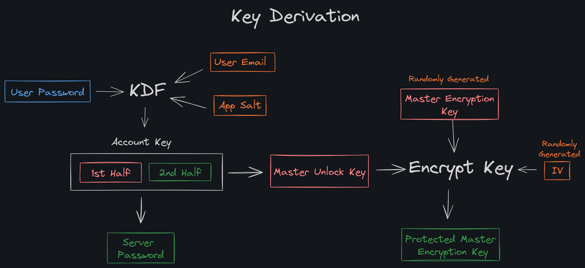
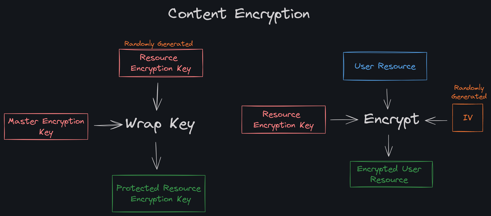

# Localful Encryption Specification - `v1`
This document contains the `v1` specification which described how the [`@localful/local`](../../projects/local) package achieves client-side encryption.  
This document includes some references to the client-server architecture, security and data structures used in Localful too, but the primary focus is on the client-side encryption methodology.  
Topics such as local-first design, cross-device synchronisation and most importantly server authentication are covered in their own documentation.

---

⚠️ **Warning** ⚠️  
I'm not a mathematician, cryptographer or security expert. If you think there is a problem with this specification or my implementation, please let me know.  
I trust this specification and my implementation enough to use Localful in production myself, but at the end of the
day this is a side project I've made to solve my own needs and to learn.  
This spec and my implementation have not been officially audited or anything like that... it's a personal project.

---

## Threat Model & Requirements
TODO

## Introduction
TODO - Add context about the Localful data structure and functionality that informs this specification.

## Summary
- To use Localful (even just locally with no server) a user must supply a `user email` and `user password`.  
- The `user email` and `user password` are used to derive an `account key` which is then split into a `master unlock key` and `server password`.  
- The `server password` can be used in server authentication if required, and is never stored on the device.
- The `master unlock key` is used to encrypt a randomly generated `master encryption key` which produces a `protected master encryption key`. This protected/encrypted value can be uploaded to the server if required.
- When a resource needs to be encrypted, a `resource encryption key` is randomly generated and is encrypted with the `master encryption key` to produce a `protected resource encryption key`. This protected/encrypted value can be uploaded along with the resource if required.
- The `account key` and `master unlock key` are never persisted anywhere, and the `master encryption key` and `resource encryption keys` are only ever kept decrypted in memory.
- As keys are never stored unencrypted on the device, by default a user must supply `user password` every time they want to access their content again (for example on a new browser session, window, tab etc).
- An optional `user passcode` can be set up instead of using `user password` every time. This passcode can be used to derive a `local unlock key` to encrypt/decrypt the `master encryption key` on the device only.

### Key Derivation Diagram

### Encryption Diagram

## Implementation Details

### KDF & Encryption Details
- `Argon2id` is used to derive a 512 bit `account key` from the `user password`, using `user email + <app salt>` as salt.
  - `Argon2id` is configured with `64 MiB` of memory, 3 iterations and 4 parallelism.
  - `<app salt>` is set by the application using Localful, and should be a random value not something like `app-name`.
- The `account key` is split in the middle for a 256 bit `master unlock key` and 256 bit `server password`.
- The randomly generated `master encryption key` and `resource encryption keys` are both 256 bit.
- `AES-GCM-256` is used for encrypting keys and resources, with randomly generated IV values.

### Encrypted Data Format

Encrypted data is stored as a string in the format `<metadata>:<initialization-vector>:<ciphertext>`:
- `<metadata>` is currently just the Localful encryption spec version used (`v1`).
- `<initialization-vector>` is a base64 encoded version of the IV value used
- `<ciphertext>` is a base64 encoded version of the encrypted data

### Javascript Libraries
- Argon2id is implemented using [argon2-browser](https://www.npmjs.com/package/argon2-browser).
- The standard [Web Crypto API](https://developer.mozilla.org/en-US/docs/Web/API/Web_Crypto_API) is used for all cryptographic functions except Argon2id.
- Client encryption methods are implemented in package `@localful/local` and can be found at [`projects/local/src/encryption`](../../../projects/local/src/encryption).

## Possible Improvements
- How would the specification in use and encryption method be updated once deployed in a real application? This is partly covered in the migration docs but could be made clearer here.
- Consider using `XChaCha20+Poly1305` for encryption? (Using [libsodium-wrappers](https://www.npmjs.com/package/libsodium-wrappers)?)
- Server uses traditional password system. Could use Secure Remote Password (SRP) protocol instead?
- Salt used in `account key` derivation is not random, but should at least unique across users & apps. Should a truly random `salt` value be used instead?
  - I would then have to upload this to the server or make the user store two secrets.
  - If stored on server, would need an API route to retrieve this on sign in. This route would have to be public or protected by 2FA? This would be like Standard Notes
  - If user needs two secrets, this would be like 1Password's two-secret system.
  - Any dramatic complexity added to sign up would have to be implemented in all applications using Localful.
- Could a different `encryption password` and `account password` value be used?

## Credits
The method of splitting the derived `user key` into `master encryption key` and `server password` was inspired by the [Standard Notes 004](https://github.com/standardnotes/snjs/blob/main/packages/snjs/specification.md) specification.
