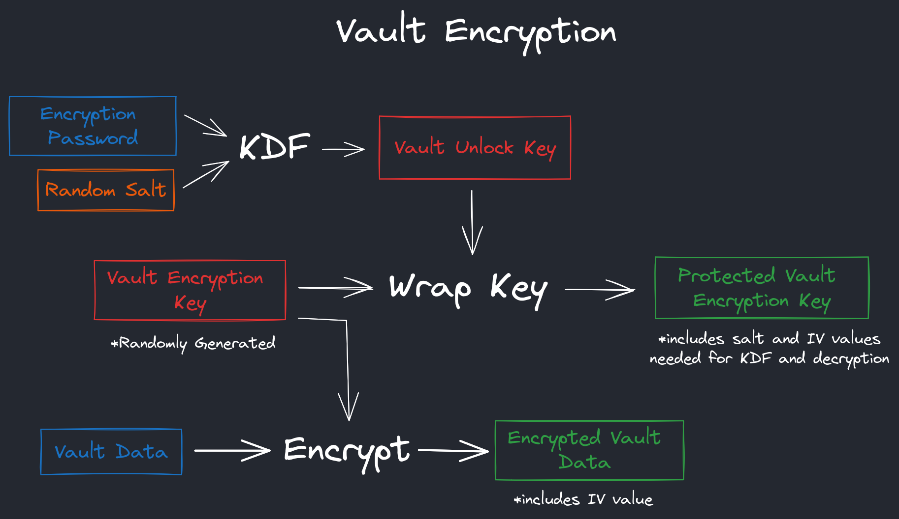

# Localful Encryption Specification - `v1`
This document contains the `v1` specification which described how the Localful project achieves client-side encryption.  
It also describes how user credentials are processed before being passed to the server, if server functionality is enabled.  

There are references to the client-server architecture, security and data structures of Localful too, but the primary focus is on the specific cryptographic methods used on device.  
Topics such as local-first design, cross-device synchronisation and most importantly server authentication and session management are not covered here.

---

⚠️ **Warning** ⚠️  
I'm not a mathematician, cryptographer or security expert. If you think there is a problem with this specification or my implementation, please let me know.  
I trust this specification and my implementation enough to use Localful in production myself, but at the end of the
day this is a side project I've made to learn and solve my own needs.

---

## Introduction
Localful works by creating vaults and then creating resources, changes and blobs within that vault.  
Encryption happens at a vault level, so all resources, changes and blobs within a vault are encrypted using
the same key, but a different vault and its content is encrypted using a different key.

TODO
- Add more context about Localful and the required functionality that influences this spec.
- What is the purpose of this encryption? What is the threat model etc

## Summary
**Vault Encryption**
- When setting up a vault, users supply an `encryption password`. This password and a random salt are used to derive a `vault unlock key`.
- A random `vault encryption key` is generated and encrypted with the `vault unlock key` which produces a `protected vault encryption key`.
- The `protected vault encryption key` includes the random salt used in key derivation and the IV value used when encrypting the key.
- The `vault encryption key` and `vault unlock key` are only ever stored in memory, `protected vault encryption key` is saved to local storage and can be uploaded to the server.
- All vault content including resources, changes and blobs will then be encrypted using `vault encryption key`.
- To allow Localful to work effectively, some data is not encrypted:
  - Content ids and timestamps.
  - Relationships such as the resource a change belongs to, what vault resources and blobs belong to etc.
  - The **vault name is not encrypted**. This is to allow for a user-friendly way of identifying vaults prior to decryption.

---

**Server Password**
- The server credentials (`account email` and `account password`) are totally separate to any vault encryption in order to easily support local-only uses.
- The `account password` is used to derive an `account key`, where `account email` and an app specific `app salt` are combined as the salt for the KDF function.
- The `account key` is then split in half, where the second half becomes the `server password`.
- The `server password` is then used in server authentication along with `account email`.
- The first half of the split `account key` has no current purpose, but may in future functionality.

## Implementation Details

### Key Derivation
- `Argon2id` is used for key derivation, configured with `64 MiB` of memory, 3 iterations and 4 parallelism.
- For `encryption password`:
  - a 256 bit `vault unlock key` is derived.
  - a random salt value is used.
- For `account password`:
  - a 512 bit `account key` is derived
  - `<account email> + <app salt>` is used as a salt value, where `<app salt>` is a random (but global) value set by the application using Localful.
  - The `account key` is split into a 256 bit secret value (currently unused) and a 256 bit `server password`.

### Encryption
- `AES-GCM-256` is used for encrypting keys and resources, with randomly generated IV values.

### Encrypted Data Format
All encrypted data is stored as a string in the format `<spec>:<metadata>:<ciphertext>`:
- `<spec>` is just the Localful encryption spec version used (`v1`).
- `<metadata>` is base64 encoded and includes the IV value used in encryption and possibly the salt value if appropriate.
- `<ciphertext>` is a base64 encoded version of the encrypted data.

### Javascript Libraries
- Argon2id is implemented using [argon2-browser](https://www.npmjs.com/package/argon2-browser).
- The standard [Web Crypto API](https://developer.mozilla.org/en-US/docs/Web/API/Web_Crypto_API) is used for all cryptographic functions except Argon2id.
- Client encryption methods are implemented in package `@localful/local` and can be found at [`projects/local/src/encryption`](../../../projects/local/src/encryption).

## Possible Improvements
- How would the specification in use and encryption method be updated once deployed in a real application? This is partly covered in the migration docs but could be made clearer here.
- Consider using `XChaCha20+Poly1305` for encryption? (Using [libsodium-wrappers](https://www.npmjs.com/package/libsodium-wrappers)?)
- Server uses traditional password system. Could use Secure Remote Password (SRP) protocol instead?
- Salt used in `account key` derivation is not random, but should at least unique across users & apps. Should a truly random `salt` value be used instead?
  - I would then have to upload this to the server or make the user store two secrets.
  - If stored on server, would need an API route to retrieve this on sign in. This route would have to be public or protected by 2FA? This would be like Standard Notes
  - If user needs two secrets, this would be like 1Password's two-secret system.
  - Any dramatic complexity added to sign up would have to be implemented in all applications using Localful.
